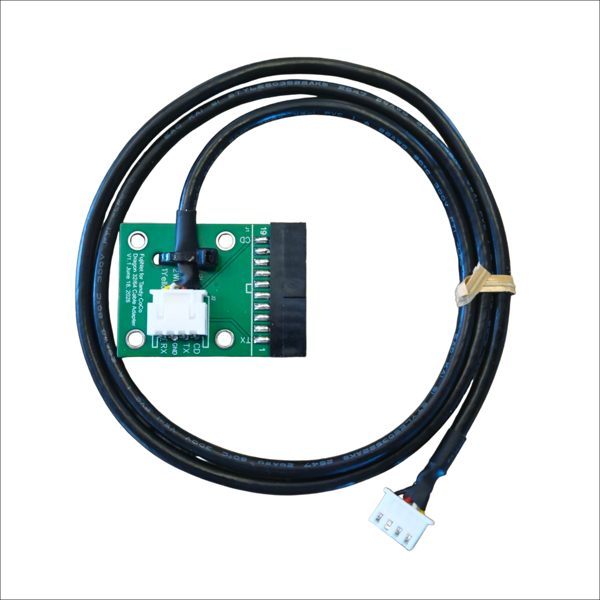

# CoCo FujiNet Dragon Adapter

This adapter provides a replacement cable assembly for the CoCo FujiNet Rev0000, allowing it to connect to a Dragon 32/64 computer.

The cable assembly includes a PCB that provides a mounting platform for the 2×10 female IDC header that mates with the Dragon's Centronics connector.

To use this adapter, your Rev0000 board must have the EEPROM image dated June 15, 2026 (or later) and FujiNet firmware version 1.6.1 (or later). Earlier versions introduced significant timeout issues that prevented reliable operation.

Schematic - [https://djtersteegc.github.io/fujinet-hardware/Coco/CoCo-FujiNet-Rev000-Schematic.pdf](https://github.com/FutureVision-Research/fujinet-hardware/blob/master/Coco/CoCo-FujiNet-Dragon-Adapter/CoCo-FujiNet-Dragon-Adapter-PCB-Schematic.pdf)

# PCB BOM

| Component                               | Qty  | Notes                              | Link                                                         |
| --------------------------------------- | ---- | ---------------------------------- | ------------------------------------------------------------ |
| 4P Right Angle XH2.54 JST Connector     | 1    |                                    | [AliExpress](https://www.aliexpress.us/item/2251832822174658.html) |
| IDC-20 (2x10) Female Header             | 1    |                                    | [AliExpress](https://www.aliexpress.us/item/2251832769816317.html) |
| Small cable tie                         | 1    |                                    |                                                              |

**Note: When ordering the PCB, use a thickness of 2mm. The ensures the best fit for the IDC-20 Header.**

#PCB Assembly
1) Solder the JST connector with its opening facing the two holes labeled "Cable Tie."
2) Solder the IDC-20 connector to the edge of the PCB. Be sure to align the connector's key with the key marked on the top silkscreen.
Note: To hold the IDC-20 connector in place while soldering, insert a second IDC-20 connector on the opposite side of the PCB and clamp the assembly together with a vise.

#Cable Parts List

| Component                               | Qty        | Notes                                 | Link                                                         |
| --------------------------------------- | ----       | ----------------------------------    | ------------------------------------------------------------ |
| 4P XH2.54 JST Recepticle                | 2          |                                       | [AliExpress](https://www.aliexpress.us/item/2251832815492773.html) |
| Four core 26AWG Shielded cable          | 34" (76cm) | Provides 4" more than is needed       | [AliExpress](https://www.aliexpress.us/item/3256801872028158.html) |
| 3/16" Heat Shrink                       |            |                                       | [AliExpress](https://www.aliexpress.us/item/3256801872028158.html) |

# Cable Assembly
Terminate both sides of the cable with 4P XH2.54 JST recepticles using the same pinout as the standard CoCo-FujiNet cable.
The difference is that you must connect the white wire in the cable (ground) as a drain to the cables shield.
It is highly recommended to place heat-shrink tubing over the exposed wires and the end of the cable jacket.

# Enclosure
STL files are provided for a PCB enclosure. It is designed to be printed at a .02mm layer height. Use four M3×10 flathead screws to secure the enclosure.
1) One wall of the bottom half of the enclosure is shorter than the others. Place the PCB into the bottom half of the enclosure so that the shorter wall is adjacent to the IDC-20 connector.
2) Install the top half of the enclosure so that the opening allows the cable to exit the enclosure.
Note: The IDC-20 connector and a portion of the PCB will remain outside the enclosure to provide clearance for the Dragon's case. If desired, you can cover the exposed portion of the PCB and the IDC-20 solder tabs with a 3/4 diameter piece of heat-shrink tubing. Do not place heat-shrink tubing over the IDC-20 connector itself.

# Final Assembly
1) Connect one side of the cable to the Dragon Adapter PCB.
2) Attach and tighten a cable tie using the two provided holes on the PCB. This provides strain relief and esures the cable reamins connected
3) Mount inside a 3D printed enclosure if desired.
4) Open the CoCo FujiNet Rev0000 cartridge, cut the strain relief cable tie for the cable and gently unplug the existing cable.
5) Connect the Dragon Adapter.
6) Set both DIP switches to OFF.

